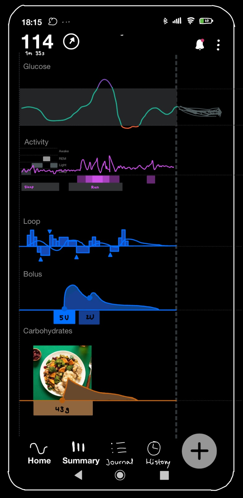

# Diafit App
Diafit is an Android application designed for people with diabetes. It brings together all relevant health data in one place, applying advanced visual analytics and artificial intelligence to support better glucose management.

## 📊 Data Tracked
The app includes all data that could potentially have an impact on glucose:
Diafit collects and visualizes data that can influence glucose levels, including:
- **Continuous Glucose Monitoring (CGM)** data
- **Nutrition**: carbohydrates, proteins, fats, and calories
- **Activity**: heart rate, step count, and exercise sessions
- **Sleep** duration and quality

## ✨ Features
- 📷 **Automated nutrient estimation** from food photos
- 📈 **Interactive Visualizations** revealing patterns across different types of data
- 🧠 **AI-Based Clustering** of similar glucose curves (e.g., meals, activities, sleep periods) to uncover trends

## 🔍 Preview

## 🔌 Supported Data Integrations
### Remote Sources
- [Nightscout](https://nightscout.github.io/)
- [Tidepool](https://www.tidepool.org/)
- [Google Health Connect](https://health.google/health-connect-android/)
  
### Local Sources
- [xDrip](https://github.com/NightscoutFoundation/xDrip)
- [Android APS (AAPS)](https://github.com/nightscout/AndroidAPS)
- [Juggluco](https://github.com/j-kaltes/Juggluco)

## 🛠️ Technologies Used
- [Kotlin](https://developer.android.com/kotlin): Core Android development
- [Android Architecture Components](https://developer.android.com/topic/architecture): Room, LiveData, ViewModel, Navigation
- [Koin](https://github.com/InsertKoinIO/koin): Dependency Injection
- [Ktor](https://github.com/ktorio/ktor): HTTP networking
- [Vico Charts](https://github.com/patrykandpatrick/vico): Advanced data visualization
- [Espresso](https://developer.android.com/training/testing/espresso): UI testing
- [Mockito](https://github.com/mockito/mockito): Unit testing

## 🧱 Architecture
Diafit follows **Clean Architecture** principles using **MVVM** and **Repository** patterns. It aligns with best practices outlined in Google’s [Guide to App Architecture](https://developer.android.com/topic/architecture).
